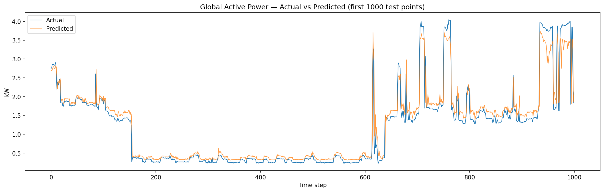

# ⚡ Electricity Consumption Forecasting

An end-to-end machine learning project that forecasts household electricity
consumption using an LSTM neural network, with an interactive Streamlit
dashboard for visualization and forecasting.

Built on the [UCI Household Power Consumption dataset](https://archive.ics.uci.edu/dataset/235/individual+household+electric+power+consumption) —
real, minute-level power usage readings from a single household in Sceaux,
France, spanning December 2006 to November 2010 (~2 million records).

---

## 📌 Overview

This project walks through a complete forecasting pipeline:

1. **EDA** — understand daily, weekly, and seasonal consumption patterns
2. **Preprocessing** — clean, engineer features, scale, and window the data for sequence modeling
3. **Modeling** — train an LSTM to forecast next-step power consumption
4. **Evaluation** — measure performance with RMSE, MAE, and R²
5. **Dashboard** — an interactive Streamlit app to explore live data, generate forecasts, and inspect model performance

---

## 🗂️ Project Structure

```
Electricity-Consumption-Forecasting/
│
├── notebook/
│   ├── eda.ipynb                       # Exploratory data analysis
│   ├── preprocessing.ipynb             # Cleaning, feature engineering, scaling, sequencing
│   ├── lstm_model.ipynb                # LSTM training and evaluation
│   └── household_power_consumption.txt # Raw dataset (UCI)
│
├── models/
│   ├── best_model.pth                  # Trained LSTM weights (best checkpoint)
│   └── scaler.pkl                      # Fitted StandardScaler
│
├── outputs/
│   ├── predictions.csv                 # Test-set predictions (actual vs. predicted)
│   └── plots/
│       ├── loss_curve.png              # Training/validation loss over epochs
│       └── predictions_vs_actual.png   # Prediction quality visualization
│
├── app.py                              # Streamlit dashboard
├── requirements.txt
└── README.md
```

---

## 🧠 Model

A deep LSTM regressor implemented in PyTorch:

| Component | Detail |
|---|---|
| Input | 60-minute sliding window, 11 features per timestep |
| Architecture | LSTM (hidden size 128, 4 layers, dropout 0.3) → Linear(128→128) → ReLU → Dropout(0.3) → Linear(128→64) → ReLU → Dropout(0.2) → Linear(64→32) → ReLU → Linear(32→1) |
| Target | `Global_active_power` (next-minute prediction) |
| Loss | MSE |
| Optimizer | Adam with `ReduceLROnPlateau` scheduling |
| Early stopping | Patience-based, on validation loss |

> Earlier iterations used a smaller 2-layer, hidden-size-64 LSTM. This deeper
> architecture (4 layers, hidden size 128, wider FC head) trades more
> training time for greater model capacity — see [Results](#-results) for
> current numbers, and [Limitations](#️-known-limitations) for the tradeoffs.

**Features used:** `Global_reactive_power`, `Voltage`, `Global_intensity`,
`Sub_metering_1/2/3`, plus engineered calendar features — `Hour`, `Day`,
`Month`, `Year`, `Weekday`.

**Train/test split:** time-ordered 80/20 (no shuffling — shuffling a time
series would leak future information into training).

---

## 📊 Results

> ⚠️ The numbers below are from the earlier, smaller architecture (2 layers,
> hidden size 64). They're kept here as a baseline reference. Re-run
> `lstm_model.ipynb`'s evaluation cell with the deeper model to update this
> table with current numbers.

Evaluated on the held-out test set (~415K sequences):

| Metric | Value | What it means |
|---|---|---|
| **RMSE** | 0.2091 | Average error in kW, penalizes large misses more heavily |
| **MAE** | 0.1031 | On average, predictions are off by ~0.10 kW |
| **R²** | 0.9434 | The model explains ~94% of the variance in power consumption |



---

## 🖥️ Dashboard (`app.py`)

An interactive Streamlit dashboard with four views:

- **📈 Live Consumption** — recent readings with adjustable lookback window and summary metrics (current/average/peak)
- **🔮 Forecast** — multi-step forecasting with a selectable horizon (15 min / 1 hr / 6 hr / 24 hr), plus peak-usage alerts
- **📊 Daily Average** — daily, weekly, and monthly consumption trends
- **📉 Actual vs Predicted** — live-computed RMSE/MAE/R² and a visual backtest against the test set

Supports uploading custom consumption data in the same format as the source dataset.

### Run it

```bash
pip install -r requirements.txt
streamlit run app.py
```

---

## ⚠️ Known Limitations

Being upfront about these (and being able to discuss them) matters more than
pretending they don't exist:

- **Multi-step forecasting uses naive persistence for exogenous features.**
  The model only predicts `Global_active_power`. For forecasts beyond one
  step, features like voltage and sub-metering are held at their last known
  values rather than truly forecasted — reasonable for short horizons, less
  reliable the further out you go (e.g. 24 hours).
- **Single household, not generalizable.** Patterns learned here reflect one
  home's habits, not a broader population.
- **No exogenous drivers like weather.** Temperature is typically one of the
  strongest external predictors of household power usage and isn't included
  in this dataset.
- **Minute-level granularity is noisy.** Most real-world forecasting use
  cases (billing, grid planning) operate at hourly or daily resolution;
  minute-level data trades some predictability for detail.
- **Trained for a limited number of epochs** due to CPU-only training time
  constraints. Validation loss was still improving at cutoff — a longer
  training run would likely improve results further.

---

## 🔧 Tech Stack

- **PyTorch** — LSTM model definition, training, inference
- **scikit-learn** — preprocessing (`StandardScaler`), evaluation metrics
- **pandas / NumPy** — data handling
- **Streamlit + Plotly** — interactive dashboard
- **joblib** — model/scaler persistence

---

## 🚀 Future Improvements

- Retrain for true multi-step forecasting (direct multi-output instead of recursive rollout)
- Incorporate weather data as an exogenous feature
- Compare against a traditional ML baseline (gradient boosting with lag features) for a rigorous DL-vs-ML evaluation
- Electricity bill estimation based on forecasted usage and configurable tariff rates
- Modularize `app.py` into a `utils/` package (prediction, alerts, billing, visualization, explanation)

---

## 📖 Dataset Citation

Hebrail, G. & Berard, A. (2012). Individual Household Electric Power
Consumption [Dataset]. UCI Machine Learning Repository.
https://doi.org/10.24432/C58K54
